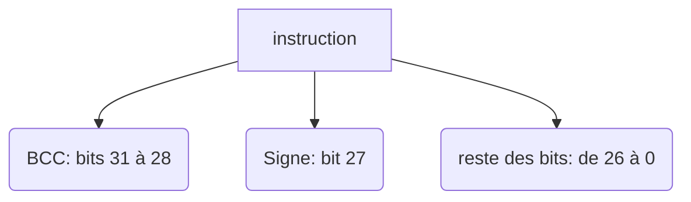
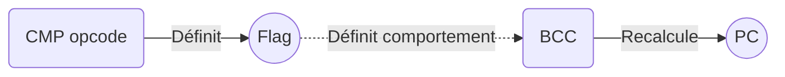

# Processeur Virtuel

> Gauthier Petitjean & Thomas Serabian
---
## Coeur Virtuel

#### Encodage Instruction :
| BCC [31;28]| Toujours 0 [27;25]| Flag Valeur Immédiate {24}| Code Opérande [23;20]|Première Opérande [19;16]| Seconde Opérande [15;12]|Registre Destination  [11;8]    | Valeur Immédiate [7;0]|
| ----------- | ----------- |----------- | ----------- |----------- | ----------- |----------- | ----------- |
| 0000      | 000       |0      | 0000       |0000      | 0000       |0000      | 0000 0000       |

#### Description 
* **BBC** : Condition de branchement; Si cela correspond à un code opérande (voir sujet: tableau 2.5.2), le reste des bits permet de calculer l'adresse de la prochaine instruction (*PC*)
* **Flag valeur immédiate** : 0 ou 1; indique si le second membre de l'opération est la valeur immédiate ou la seconde opérande
* **Code opérande** : Précise l'opérande à utiliser (voir sujet : tableau 2.5.4 et tableau 2.5.5)
* **Première opérande** : Registre utilisé en premier membre d'opération
* **Deuxième opérande** : Registre utilisé en second membre d'opération
* **Registre destination** : Registre utilisé pour garder le résultat de l'opération
* **Valeur immédirate** : Valeur passée via le code

#### Formule Branchement
Le BBC permet de calculer le PC via la formule en 2.5.2 du sujet. Le bit 27 indique si on ajoute ou soustrait. Le reste des bits (26 à 0) indique de combien on incrémente/décrémente le PC.

**Structure de l'instruction en cas de branchement :**

#### CMP OP code
Les codes opérandes de comparaison initialisent des flags permettant aux conditions branchements (BCC) de décider si on effectue le branchement.

## Compilateur

* Le format de sortie doit avoir l'extension **.s**.
* Une instruction par ligne
* Format de l'instruction : 
    1. big endian binaire **32-bits**
    2. format branchement : `OP_CODE_BRANCHEMENT OFFSET`
    3. format standard : `OP_CODE DESTINATION OPÉRANDE1  OPÉRANDE2`
    4. format CMP : `OP_CODE_CMP OPÉRANDE1  OPÉRANDE2`
    
> Les opérandes CMP (comparaison) n'ont pas de registre de destination car elles agissent sur les flags
# ToDo

## Coeur
* [ ] *fonction* **fetch :**  Lit l'instruction à exécuter et calcule la nouvelle valeur du PC
* [ ] *fonction* **decode :** Décode l'instruction (décrite dans le tableau)
* [ ] *fonction* **execute :** Réalise l'opération (en héxadécimal)

## Compilateur
* [ ] test
* [ ] test
* [ ] test

### Programmes
#### Programme 1

Il s'agit d'initialiser des registres au démarage.
L'objectif est de partir des registres mentionnés dans le tableau 3.3 initialisé à 0 et de changer leur valeur par celle du tableau
#### Programme 2
#### Programme 3
